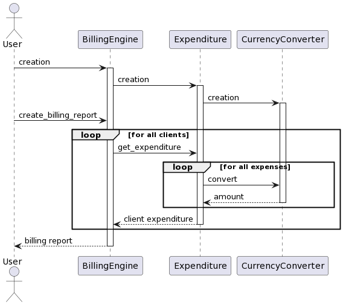

# Billing Engine Exercise

## Application requirements
- Python 3.X
- pandas library

## How to run
To run, download the files of this repository. Then run the python script bill_calculator.py.
The script has the following optional arguments:
| Argument |  Default |  Description |
|---|---|---|
| -o --output  | output.csv  | Name of the output report file |
| -c --clients |  clients.csv | Name of the input file containing the clients' information  |
| -f --fx-rates |  fx_rates.csv | Name of the input file containing the currency conversion information |
| -p --platform-spend |  platform_spend.csv |  Name of the input file containing the platform spending information |

For example, you could run the script with the following command:
`py bill_calculator.py -o output.csv -c clients.csv -f fx_rates.csv -p platform_spend.csv`

Or, just using the default arguments:
`py bill_calculator.py`

## Tests
You could run the project tests with:
`py test.py`

## Sequence diagram
